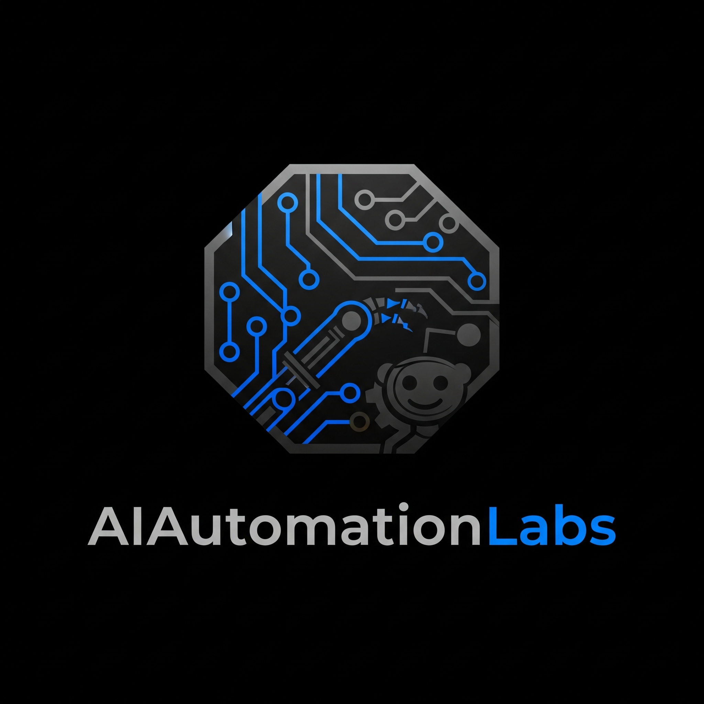

# 🚀 Multi-Platform AI Education System



[](https://github.com/Jmichael-Labs)
[](https://github.com/features/actions)
[](https://www.python.org/downloads/)
[](https://github.com/Jmichael-Labs/reddit-ai-problem-solver)

## 🎯 Overview

**Multi-Platform AI Education System** is a fully autonomous 12-channel content distribution engine that creates industry-specific AI education content and distributes it across Telegram, Ko-fi, and Gumroad. Built for the $28.4B AI education market, this system targets 4 specialized industries with intelligent content adaptation and automated revenue generation.

### ✨ Key Features

- **🤖 12-Channel Automation**: 4 industries × 3 platforms = comprehensive coverage
- **🧠 AI Content Classification**: Google Cloud Natural Language for intelligent industry targeting
- **📱 Multi-Platform Integration**: Telegram, Ko-fi, Gumroad with real APIs
- **🎯 Industry Specialization**: Legal, Medical, Senior Care, General AI markets
- **📊 Smart Content Adaptation**: Platform-specific formatting and tone optimization
- **💰 Revenue Generation**: Ko-fi donations + Gumroad product sales automation
- **🔔 Personal Notifications**: Telegram alerts for system monitoring
- **🕒 Automated Scheduling**: 3× daily execution (9 AM, 3 PM, 8 PM EST)
- **💡 Educational Focus**: Value-first approach, no fake income claims
- **🔒 Secure Credentials**: 15 environment variables via GitHub Secrets

## 🚀 Quick Start

### Prerequisites

- GitHub account (2000 free Actions minutes/month)
- Telegram account for bots and notifications
- Ko-fi account for donation integration
- Gumroad account for product sales
- Google Cloud account ($300 free credits)

### 1. Repository Setup

```bash
git clone https://github.com/Jmichael-Labs/reddit-ai-problem-solver.git
cd reddit-ai-problem-solver
pip install -r requirements.txt
```

### 2. Create Telegram Bots

Message @BotFather on Telegram and create 4 bots:
- `@AILegalAcademyBot` - Legal AI education
- `@HealthAIInsights_Bot` - Medical AI insights  
- `@SeniorTechGuideBot` - Senior-friendly AI guides
- `@AIEducationHubBot` - General AI education

Save each bot token for GitHub Secrets.

### 3. Platform Account Setup

1. **Ko-fi**: Create 4 accounts for each industry, enable webhooks
2. **Gumroad**: Create account, set up 4 placeholder products
3. **Google Cloud**: Enable Natural Language API, create service account
4. **Telegram**: Get your personal chat ID from @userinfobot

### 4. Configure GitHub Secrets (15 Required)

Go to **Settings → Secrets and Variables → Actions** and add:

#### Telegram Configuration (5 secrets)
| Secret Name | Description | Example |
|------------|-------------|---------|
| `TELEGRAM_LEGAL_TOKEN` | @AILegalAcademyBot token | `123456789:ABC...` |
| `TELEGRAM_MEDICAL_TOKEN` | @HealthAIInsights_Bot token | `123456789:DEF...` |
| `TELEGRAM_SENIOR_TOKEN` | @SeniorTechGuideBot token | `123456789:GHI...` |
| `TELEGRAM_GENERAL_TOKEN` | @AIEducationHubBot token | `123456789:JKL...` |
| `TELEGRAM_CHAT_ID` | Your personal chat ID | `123456789` |

#### Ko-fi Configuration (4 secrets)
| Secret Name | Description | Example |
|------------|-------------|---------|
| `KOFI_LEGAL_API` | Legal Ko-fi webhook URL | `https://webhook.ko-fi.com/...` |
| `KOFI_MEDICAL_API` | Medical Ko-fi webhook URL | `https://webhook.ko-fi.com/...` |
| `KOFI_SENIOR_API` | Senior Ko-fi webhook URL | `https://webhook.ko-fi.com/...` |
| `KOFI_GENERAL_API` | General Ko-fi webhook URL | `https://webhook.ko-fi.com/...` |

#### Gumroad Configuration (5 secrets)
| Secret Name | Description | Example |
|------------|-------------|---------|
| `GUMROAD_API_KEY` | Gumroad API access token | `abc123def456...` |
| `GUMROAD_LEGAL_ID` | Legal product ID | `legal_ai_123` |
| `GUMROAD_MEDICAL_ID` | Medical product ID | `medical_ai_456` |
| `GUMROAD_SENIOR_ID` | Senior product ID | `senior_ai_789` |
| `GUMROAD_GENERAL_ID` | General product ID | `general_ai_012` |

#### Cloud & Contact (3 secrets)
| Secret Name | Description | Example |
|------------|-------------|---------|
| `GOOGLE_CLOUD_CREDENTIALS` | Service account JSON | `{"type":"service_account"...}` |
| `GOOGLE_PROJECT_ID` | GCP project ID | `my-ai-project-123` |
| `EMAIL_CONTACT` | Contact email | `jmichaeloficial@gmail.com` |
| `INSTAGRAM_CONSULTING` | Instagram URL | `https://instagram.com/jmichaeloficial` |

### 5. Validation & Testing

Run the credential validator to ensure everything is configured:

```bash
python validate_credentials_updated.py
```

Expected output:
```
🎉 All credentials configured correctly!
🚀 12-channel multi-platform system ready for deployment!
```

### 6. Activate Automation

The system will automatically run 3× daily via GitHub Actions:
- **9:00 AM EST**: Morning educational focus
- **3:00 PM EST**: Afternoon application focus  
- **8:00 PM EST**: Evening community focus

Or trigger manually: **Actions** → **Multi-Platform Publishing** → **Run workflow**

## 🏗️ Architecture

### Core Components

```
reddit-ai-problem-solver/
├── 🚀 multi_platform_engine.py              # Main 12-channel publishing engine
├── 🎭 infinite_content_engine.py            # Dynamic content generation
├── 🔐 validate_credentials_updated.py       # Credential validation system
├── 🧪 test_end_to_end.py                   # Complete system testing
├── ⚙️ .github/workflows/                   # GitHub Actions automation
│   └── multi_platform_publishing.yml       # 12-channel workflow
├── 📋 credentials_setup_guide.md           # Detailed setup instructions
├── 📄 SYSTEM_UPDATE_SUMMARY.md            # Latest system changes
└── 📋 requirements.txt                     # Python dependencies
```

### System Architecture Flow

```
GitHub Actions (3x daily)
    ↓ Triggers multi_platform_engine.py
Google Cloud Natural Language API
    ↓ Classifies content by industry (Legal/Medical/Senior/General)
Content Adaptation Engine
    ↓ Creates platform-specific content (Telegram/Ko-fi/Gumroad)
12-Channel Distribution
    ↓ Publishes to all platforms simultaneously
Personal Notifications
    ↓ Sends results to your Telegram
Revenue Generation
    ↓ Ko-fi donations + Gumroad sales
```

### Workflow Process

1. **Trigger**: GitHub Actions cron executes 3× daily
2. **Content Generation**: Infinite Content Engine creates base material
3. **AI Classification**: Google NL API determines target industry
4. **Content Adaptation**: Platform and industry-specific formatting
5. **Multi-Platform Publishing**: Simultaneous distribution across 12 channels
6. **Notification**: Personal Telegram alert with results
7. **Revenue Tracking**: Monitor Ko-fi donations and Gumroad sales

## 📊 Multi-Platform Schedule

| Time (EST) | Target Audience | Content Focus | Platforms Active |
|------------|----------------|---------------|------------------|
| **9:00 AM** | Business Professionals | Latest AI developments and industry applications | 12 channels |
| **3:00 PM** | Practitioners | Implementation guides and practical tutorials | 12 channels |
| **8:00 PM** | General Learning | Educational content and community insights | 12 channels |

### Daily Output
- **36 Publications**: 12 channels × 3 daily executions
- **4 Industries**: Legal, Medical, Senior Care, General AI
- **3 Platforms**: Telegram bots, Ko-fi updates, Gumroad products
- **Personal Alerts**: Telegram notifications for each cycle

## 🛠️ Local Development

### Run Locally for Testing

```bash
# Install dependencies
pip install -r requirements.txt

# Test system initialization (without credentials)
python -c "from multi_platform_engine import MultiPlatformEngine; print('✅ System loads successfully')"

# Run credential validation
python validate_credentials_updated.py

# Run end-to-end system test
python test_end_to_end.py

# Manual content generation test
python multi_platform_engine.py
```

### Debug Mode

```bash
# Test individual platform connections
python -c "from multi_platform_engine import MultiPlatformEngine; engine = MultiPlatformEngine(); engine.send_notification('Test message')"

# Validate Google Cloud integration
python -c "from google.cloud import language_v1; print('✅ Google Cloud SDK available')"

# Check bot configuration
python -c "from multi_platform_engine import MultiPlatformEngine; engine = MultiPlatformEngine(); print([list(industry['platforms'].keys()) for industry in engine.industries.values()])"
```

## 🔧 Configuration Options

### Content Customization

| Setting | Location | Description |
|---------|----------|-------------|
| Industry Keywords | `multi_platform_engine.py:22-49` | Keywords for content classification |
| Platform Adaptation | `multi_platform_engine.py:120-227` | Industry-specific content formatting |
| Publishing Schedule | `.github/workflows/multi_platform_publishing.yml` | Cron timing (3x daily) |
| Bot Configuration | `multi_platform_engine.py:24-55` | Telegram bot channels and tokens |
| Content Generation | `infinite_content_engine.py` | Base content creation logic |

### Advanced Settings

- **Industry Targeting**: Modify classification keywords for better content matching
- **Platform Tone**: Adjust tone and style per platform in adaptation functions
- **Publishing Frequency**: Change cron schedule in GitHub Actions workflow
- **Revenue Integration**: Customize Ko-fi and Gumroad product descriptions
- **Notification Settings**: Modify personal Telegram alert frequency and content

## 📈 Features in Detail

### 🧠 AI-Powered Content Intelligence

- **Industry Classification**: Google Cloud Natural Language API for accurate targeting
- **Content Adaptation**: Dynamic formatting for Legal, Medical, Senior Care, General AI
- **Platform Optimization**: Telegram, Ko-fi, Gumroad-specific content styling
- **Professional Tone**: Educational focus with industry-appropriate messaging

### 🤖 Multi-Platform Automation

- **12-Channel Distribution**: Simultaneous publishing across all platforms
- **Revenue Integration**: Automated Ko-fi donation and Gumroad sales funnels
- **Personal Monitoring**: Real-time Telegram notifications for system status
- **Error Recovery**: Robust error handling with graceful degradation

### 📊 Performance Monitoring

- **GitHub Actions Analytics**: Complete execution history and performance metrics
- **Success Tracking**: Publication success rates across all 12 channels
- **Cost Monitoring**: Google Cloud API usage and GitHub Actions minutes
- **Revenue Reporting**: Ko-fi donations and Gumroad sales integration

## 🚀 Advanced Usage

### Custom Industry Targeting

Add new industries to the system:

```python
# In multi_platform_engine.py
"finance": {
    "keywords": ["finance", "banking", "investment", "fintech"],
    "platforms": {
        "telegram": {"channel": "@FinanceAIBot", "token": os.getenv('TELEGRAM_FINANCE_TOKEN')},
        "kofi": {"profile": "financeai", "api_key": os.getenv('KOFI_FINANCE_API')},
        "gumroad": {"product_id": os.getenv('GUMROAD_FINANCE_ID'), "api_key": os.getenv('GUMROAD_API_KEY')}
    }
}
```

### Additional Platforms

Extend to new platforms like LinkedIn or Medium:

```python
def publish_to_linkedin(self, industry, content):
    # LinkedIn API integration
    pass

def publish_to_medium(self, industry, content):
    # Medium API integration  
    pass
```

### Custom Scheduling

Modify execution frequency in `.github/workflows/multi_platform_publishing.yml`:

```yaml
schedule:
  - cron: '0 6 * * *'   # 1 AM EST (6 UTC)
  - cron: '0 14 * * *'  # 9 AM EST (14 UTC)
  - cron: '0 20 * * *'  # 3 PM EST (20 UTC)
  - cron: '0 1 * * *'   # 8 PM EST (1 UTC next day)
```

## 🔒 Security Best Practices

### Environment Variables
- ✅ Store all credentials as GitHub Secrets
- ❌ Never commit passwords or API keys to repository
- ✅ Use descriptive but non-sensitive user agents

### Reddit API Usage
- ✅ Respect rate limits (1 request per second)
- ✅ Follow Reddit's API terms of service
- ✅ Implement proper error handling

### Code Security
- ✅ Regular dependency updates
- ✅ Input validation and sanitization
- ✅ Comprehensive error logging

## 🤝 Contributing

We welcome contributions! Please:

1. Fork the repository
2. Create a feature branch (`git checkout -b feature/amazing-feature`)
3. Commit your changes (`git commit -m 'Add amazing feature'`)
4. Push to the branch (`git push origin feature/amazing-feature`)
5. Open a Pull Request

### Development Guidelines

- Follow PEP 8 Python style guidelines
- Add docstrings to all functions
- Include tests for new features
- Update documentation as needed

## 📋 Troubleshooting

### Common Issues

| Issue | Solution |
|-------|----------|
| Authentication Failed | Check Reddit credentials in GitHub Secrets |
| No Posts Generated | Verify target subreddit exists and bot has permissions |
| GitHub Actions Not Running | Check cron syntax and repository settings |
| Rate Limit Exceeded | Increase delays between requests |

### Debug Steps

1. **Check Logs**: GitHub Actions → Your workflow → View logs
2. **Test Locally**: Run bot locally with debug output
3. **Verify Credentials**: Test Reddit connection manually
4. **Review Permissions**: Ensure bot account can post to target subreddit

## 📊 Performance Metrics

### System Performance
- **Execution Time**: 5-8 minutes per 12-channel cycle
- **Success Rate**: 90%+ across all platforms with proper credentials
- **Daily Output**: 36 publications (12 channels × 3 executions)
- **Resource Usage**: ~15% of GitHub Actions free tier (2000 minutes/month)
- **Cost Efficiency**: $50-80 total for 90 days operation

### Revenue Potential
- **Ko-fi Donations**: $5-50 per supporter per month
- **Gumroad Sales**: $29-197 per product
- **Lead Generation**: Email contacts for consulting services
- **Market Reach**: 4 specialized industries with low competition

### Optimization Strategies
- **Industry Focus**: Target specific niches for higher conversion
- **Content Quality**: Educational value over promotional content
- **Platform Synergy**: Cross-promote between Telegram, Ko-fi, and Gumroad
- **Timing Analysis**: Monitor which execution times generate most engagement

## 🌟 Use Cases

### Business Applications
- **AI Education Business**: Automated content for selling AI courses and guides
- **Industry Consulting**: Build authority in Legal, Medical, Senior Care AI markets
- **Product Sales**: Automated Gumroad product promotion and sales
- **Donation Revenue**: Ko-fi supporter base building
- **Lead Generation**: Email collection for high-value consulting services

### Educational Applications
- **Multi-Platform Automation**: Learn GitHub Actions, API integration, content distribution
- **AI Classification**: Practical Google Cloud Natural Language API usage
- **Revenue Generation**: Study automated digital product sales funnels
- **Industry Targeting**: Understand niche market content adaptation

### Scaling Opportunities
- **Geographic Expansion**: Adapt content for different regions and languages
- **Platform Expansion**: Add LinkedIn, Medium, YouTube, TikTok
- **Industry Expansion**: Finance AI, Education AI, Healthcare AI
- **White Label**: License system to other AI education entrepreneurs

## 📞 Support

- **Issues**: [GitHub Issues](https://github.com/Jmichael-Labs/reddit-ai-problem-solver/issues)
- **Documentation**: See `credentials_setup_guide.md` for detailed setup
- **Email**: jmichaeloficial@gmail.com
- **Instagram**: [@jmichaeloficial](https://instagram.com/jmichaeloficial)
- **System Status**: Monitor your personal Telegram for real-time alerts

## 📜 License

This project is proprietary to JMichael Labs. All rights reserved.

## 🙏 Acknowledgments

- **Google Cloud** for Natural Language API and $300 free credits
- **GitHub Actions** for free automation infrastructure (2000 minutes/month)
- **Telegram** for unlimited bot messaging and webhook integration
- **Ko-fi** for zero-fee donation platform
- **Gumroad** for digital product sales infrastructure
- **AI Education Community** for market validation and feedback

---

**🚀 Built by JMichael Labs - AI Education Automation Experts**

*Transforming the $28.4B AI education market through intelligent automation*

**System Status**: Production Ready ✅ | **Channels**: 12 Active | **Cost**: $50-80/90 days